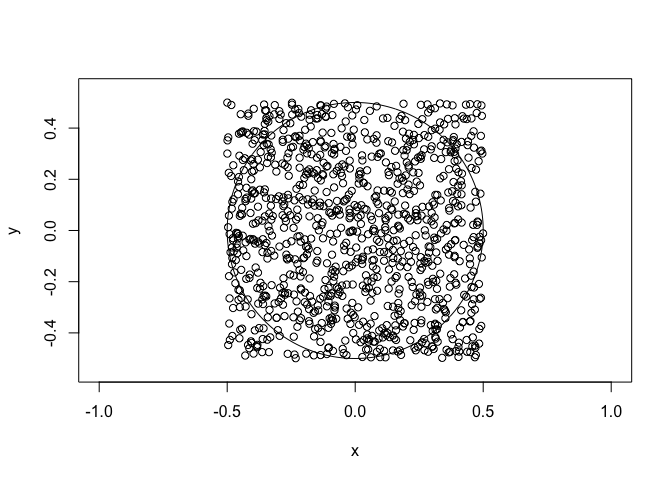

```r
library(plotrix)
```

##Monte carlo to estimate Pi

Using Monte Carlo method to estimate Pi
1. randomly generate (x, y) pairs with both having values between -0.5 and 0.5
2. draw a circle with radius 0.5 (circle has area = Pi*r^2 = Pi/4)
3. area of square is 1 * 1 = 1
4. 4 x (proportion of dots inside the circle)


```r
n = 1000 #relatively small for visualization purposes
R = 0.5
x = runif(n, min= -R, max=R)
y = runif(n, min= -R, max=R)

plot(x, y, asp = 1, xlim = c(-1, 1))
draw.circle(0, 0, 0.5, nv = 1000, border = NULL, col = NA, lty = 1, lwd = 1)
```

<!-- -->

```r
is.inside <- (x^2 + y^2) <= R^2

# 4x proportion of total that are inside the circle
4 * (sum(is.inside) / n)
```

```
## [1] 3.108
```
